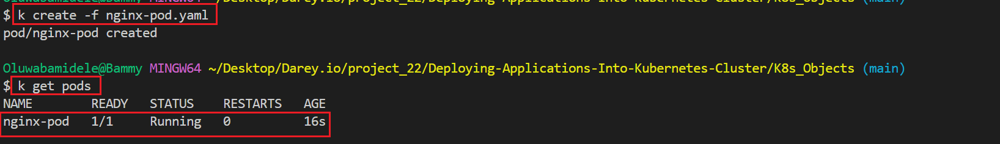
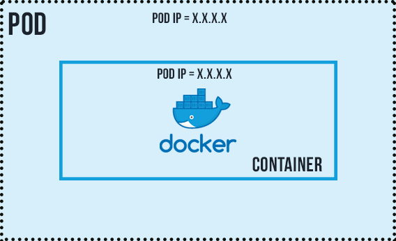
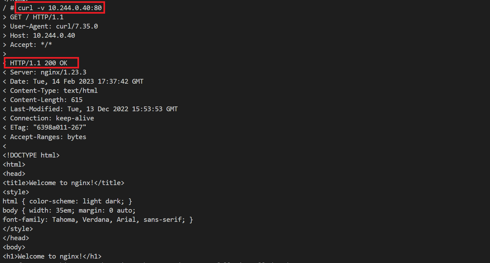
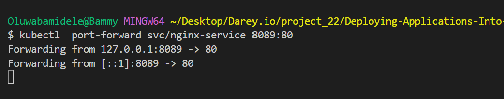
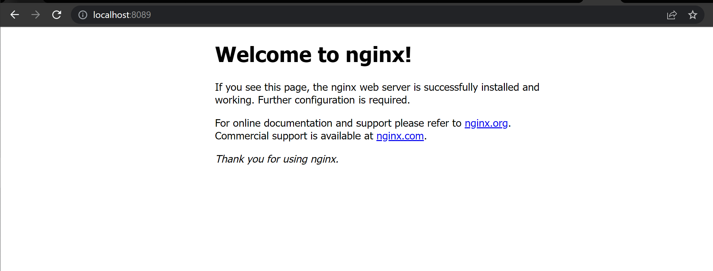
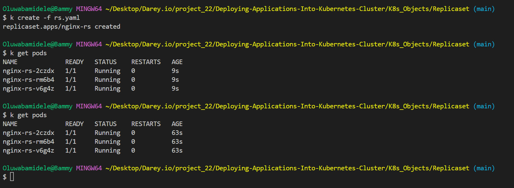
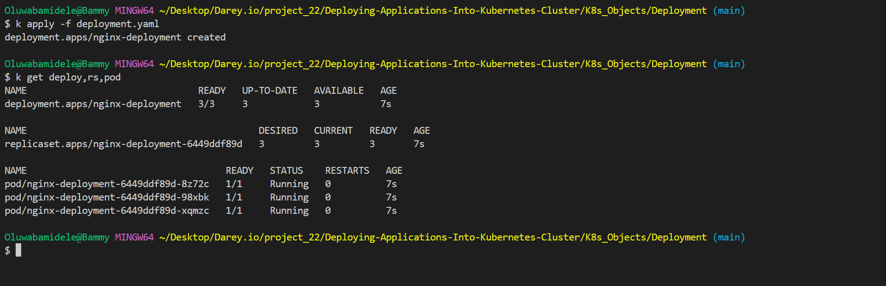

# Exploring Common Objects in K8s

## Pods

A pod is the smallest unit of kubernete cluster. It has a one to one relationship with a container. This means a pod should only hold one container. However, in some case, a pod can hold more than one related containers. To deploy an object in k8s, YAML file manifest is required with specific sections.

Let's explore how to deploy a simple nginx pod.

**Deploying a Nginx Pod**

*Create pod manifest yaml file - nginx-pod.yaml*

```bash
# Kubernetes api version
apiVersion: v1

# Type of kubernetes object to created
kind: Pod

# Provides information about the resource like name, label
metadata:
 name: nginx-pod
 labels:
  apps: nginx-pod
    
# Consists of the core information about Pod
spec:
 containers:
  - image: nginx:latest
    name: nginx-pod
    ports:
     - containerPort: 80
       protocol: TCP
```

```bash
# Use this shortcut for typing kubectl all time
alias k=kubectl
```

```bash
# Create a nginx pod
k create -f nginx-pod.yaml

# View the created pod
k get pods
```



```bash
# Get more information about the pod
k describe pod nginx-pod
or 
k get pod nginx-pod -o yaml
```

> The nginx image used in the yaml file is was pull from the docker hub, in some cases the intended repo is explicitly stated.

Although, the nginx pod is created it can not be viewed in the browser.Another Kubernetes object called ***Service*** is required to expose to the Pod.




Although, not reliable because of the ephemeral nature of pods, but for internal use only the container can be viewed by using a *curl* container ***dareyregistry/curl***


```bash
# Run kubectl to connect inside the container
kubectl run curl --image=dareyregistry/curl -i --tty

# Type curl and your container's ip
 curl -v 10.244.0.40:80
```



## Service

An abstract way to expose an application running on a set of Pods as a network service.

The Service manifest file fields are similar to that of the Pod. Let's take a look. Create a yaml file for Service - ***nginx-service.yaml***

```bash
apiVersion: v1
kind: Service
metadata:
  name: nginx-service
  labels:
    name: nginx-service
    app: server-service
spec:
  selector:
    app: nginx-pod
  ports:
    - port: 80
      protocol: TCP
      targetPort: 80
```

> Note the ***selector field***, this must be same as the labels (in this case, ***app: nginx-pod***) in the pod manifest file. This help the service object to map to particular object since they may be many pod running at any particular instance. The ***targetPort*** is set to the same value as the ***port*** field. Additionally, the Service object can also use a ***nodePort*** field to expose the Pod externally, we will see this later.

```bash
# Create service for nginx
k apply -f nginx-service.yaml

# forward the port of the service to free port on your machine localhost
k port-forward svc/nginx-service 8089:80

```



Verify in the browser



```bash
# Clean up serive
k delete svc nginx-service

# clean up pod
k delete po nginx-pod
## ReplicaSet
```


A ReplicaSet's purpose is to maintain a stable set of replica Pods running at any given time. As such, it is often used to guarantee the availability of a specified number of identical Pods.

The child field ***matchLabels*** of the ***selector*** field is used to identify the pod and a ***replica*** field is used to indicate how many pods should be maintained. It uses the template field to specify the data for the new Pod(s) it should create when scaling up or to meet the number of replicas criteria.

Let see this action

Create a replicaset manifest yaml file - rs.yaml

```bash
#Part 1
apiVersion: apps/v1
kind: ReplicaSet
metadata:
  name: nginx-rs
spec:
  replicas: 3
  selector:
    matchLabels:
      app: nginx-pod

#Part 2
  template:
    metadata:
      name: nginx-pod
      labels:
         app: nginx-pod
    spec:
      containers:
      - image: nginx:latest
        name: nginx-pod
        ports:
        - containerPort: 80
          protocol: TCP
```

```bash
# Create replicaset for ngix pod. 
k create -f rs.yaml

# View replicaset
k get rs

# View pods created by replicaset
k get pods

# Delete one of the pods
k delete po nginx-rs-2czdx

```



Notice replica is set to 3, hence the 3 pods. Even a pod is deleted, It would recreate another pod from the configuration stated in the ***template*** field hence, it will always maintain 3 avilable pods unless specified otherwise.

```bash
# Clean up
k delete rs nginx-rs
```

## Deployments

A Deployment is another layer above ReplicaSets and Pods, newer and more advanced level concept than ReplicaSets. It manages the deployment of ReplicaSets and allows for easy updating of a ReplicaSet as well as the ability to roll back to a previous version of deployment. It is declarative and can be used for rolling updates of micro-services, ensuring there is no downtime.

Officially, it is highly recommended to use Deplyments to manage replica sets rather than using replica sets directly.

The manifest file for a deployment looks similar to a replicaset but the kind is ***deployment***.

Create a deployment manifest yaml file - deployment.yaml

```bash
apiVersion: apps/v1
kind: Deployment
metadata:
  name: nginx-deployment
  labels:
    tier: frontend
spec:
  replicas: 3
  selector:
    matchLabels:
      tier: frontend
  template:
    metadata:
      labels:
        tier: frontend
    spec:
      containers:
      - name: nginx
        image: nginx:latest
        ports:
        - containerPort: 80
```

```bash
# Create deployment
k create -f deployment.yaml

# view deployment, replicaset and pods
k get deploy,rs,pod

```



```bash
# Clean up
k delete deploy nginx-deployment
```

## Persisting Data for Pods