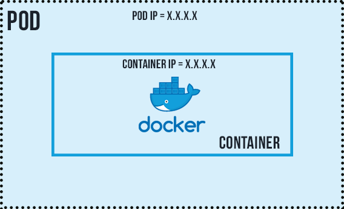

# Exploring Common Objects in K8s

## Pods

A pod is the smallest unit of kubernete cluster. It has a one to one relationship with a container. This means a pod should only hold one container. However, in some case, a pod can hold more than one related containers. To deploy an object in k8s, YAML file manifest is required with specific sections.

Let's explore how to deploy a simple nginx pod.

**Deploying a Nginx Pod**

*Create a yaml file - nginx-pod.yaml*

```bash
# Kubernetes api version
apiVersion: v1

# Type of kubernetes object to created
kind: Pod

# Provides information about the resource like name, label
metadata:
 name: nginx-pod
 labels:
  apps: nginx-pod
    
# Consists of the core information about Pod
spec:
 containers:
  - image: nginx:latest
    name: nginx-pod
    ports:
     - containerPort: 80
       protocol: TCP
```

```bash
# Use this shortcut for typing kubectl all time
alias k=kubectl
```

```bash
# Create a nginx pod
k create -f nginx-pod.yaml

# View the created pod
k get pods
```


```bash
# Get more information about the pod
k describe pod nginx-pod
or 
k get pod nginx-pod -o yaml
```

> The nginx image used in the yaml file is was pull from the docker hub, in some cases the intended repo is explicitly stated.


Although, the nginx pod is created it can not be viewed in the browser.Another Kubernetes object called ***Service*** is required to expose to the Pod.




Although, not reliable because of the ephemeral nature of pods, but for internal use only the container can be viewed by using a *curl* container ***dareyregistry/curl***


```bash
# Run kubectl to connect inside the container
kubectl run curl --image=dareyregistry/curl -i --tty

# Type curl and your container's ip
 curl -v 10.244.0.40:80
```


## Service

An abstract way to expose an application running on a set of Pods as a network service.

The Service manifest file fields are similar to that of the Pod. Let's take a look. Create a yaml file for Service - ***nginx-service.yaml***

```bash
apiVersion: v1
kind: Service
metadata:
  name: nginx-service
  labels:
    name: nginx-service
    app: server-service
spec:
  selector:
    app: nginx-pod
  ports:
    - port: 80
      protocol: TCP
      targetPort: 80
```

> Note the ***selector field***, this must be same as the labels (in this case, ***app: nginx-pod***) in the pod manifest file. This help the service object to map to particular object since they may be many pod running at any particular instance. The ***targetPort*** is set to the same value as the ***port*** field.

```bash
# Create service for nginx
k apply -f nginx-service.yaml

# forward the port of the service to free port on your machine localhost
k port-forward svc/nginx-service 8089:80
```


Verify in the browser


## ReplicaSet

A ReplicaSet's purpose is to maintain a stable set of replica Pods running at any given time. As such, it is often used to guarantee the availability of a specified number of identical Pods

